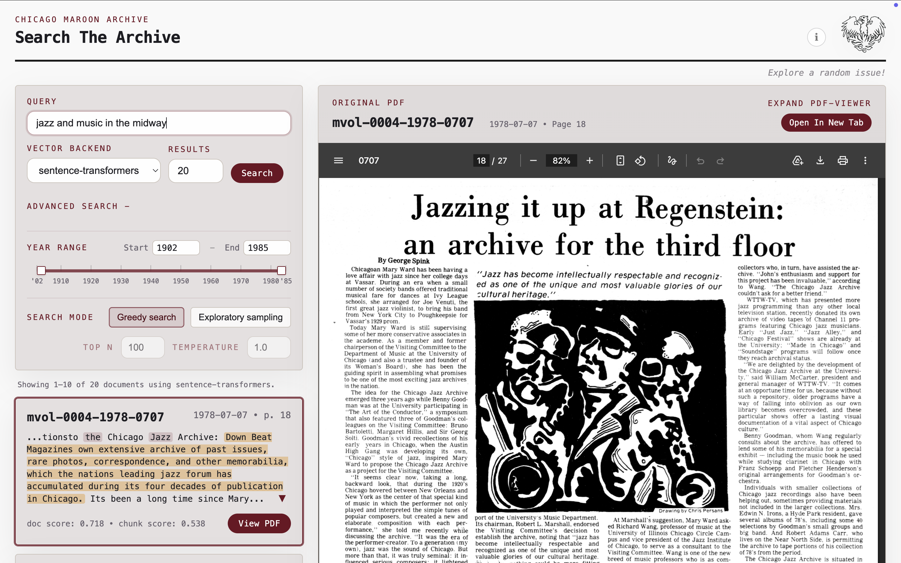
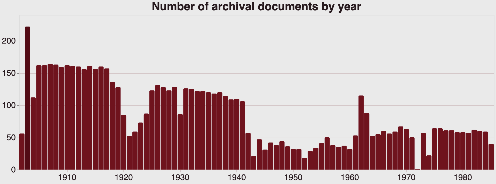

# ask-maroon

This project enables users to search the Maroon archives dating from 1902-1985. Given a query, ask-maroon uses semantic embeddings to retrieve what it thinks to be the most relevant set of articles from the collection.





https://github.com/user-attachments/assets/0ab05e58-b895-44af-beef-c8bb0c639bdb

# Archival summary
- 7,240 PDF documents from 1902-1986 (300GB)
- 181,564 chunks of 500 words overlapping by 75 words 



# Introduction
The archival text files are chunked and semantically embedded using a model specifically tuned for semantic retrieval purposes. We use sentence-transformers/all-MiniLM-L6-v2 and OpenAI's text-embedding-3-small that have been trained on pairwise sentence similarity.

In addition to finding nearest neighbors in embedding space, `ask-maroon` adds two features:
- Allow users to control greedy-sampling vs. top-N sampling, whereby we sample the top-N closest neighbors for a more exploratory search. This mimics the effects of fancier techniques like MMR, or 
- Add feature that boosts exact keyword matches if query contains double quotations. FTS weight increases from 0.1 to 0.4.
- Future improvements may include image embedding and LLM-generated query expansion to provide a more diverse content-rich query.

# Limitations
Digitizing the pdfs into text files involves some noisy text, which our embeddings could be quite sensitive to. While semantic embedding can be really rich given how much information can be stored in these higher dimensional spaces, we encourage users to thoughtfully query and parse through the results, and iteratively improve their queries. 

Dylan Freedman, author of `semantra`, describes this approach best:
> Using a semantic search engine is fundamentally different than an exact text matching algorithm.
> For starters, there will always be search results for a given query, no matter how irrelevant it is. 
> The scores may be really low, but the results will never disappear entirely. 
> This is because semantic searching with query arithmetic often reveals useful results amid very minor score differences. 

> Another difference is that Semantra will not necessarily find exact text matches if you query something that directly appears in the document. 
> At a high level, this is because words can mean different things in different contexts, e.g. the word "leaves" can refer to the leaves on trees or to someone leaving. 
> The embedding models that Semantra uses convert all the text and queries you enter into long sequences of numbers that can be mathematically compared, and an exact substring match is not always significant in this sense. 

`ask-maroon` attempts to tackle desired keyword matches by boosting FTS scores when quotes appear in queries, and enrich the richness of the search by doing top-N sampling. 

An example for where perfect alignment is not what you want is this. For example, if one were to query "poems", one would get articles directly using words related to 'poems': 'poetry', 'verse', etc. But the tool would not be able to infer or locate articles where an actual poem exists, that does not explicitly include any word related to poetry (try searching for this and see if the 1979-0928 issue comes up). In this sense, `ask-maroon` struggles with queries that involve higher-level reasoning that is not captured in the embedding.


# Tips
- Users are recommended to try extending their queries to include more relevant alternative keywords (i.e, bikes, bike, bicycles, cyclists, etc.) 
- Adding double string quotes for keywords (compare query: russian authors vs query: russian authors "tolstoy") boosts the ranking of exact keyword matches (under the hood this adds an FTS boosting score from 10% -> 40% of the weighted rank).
- Expand PDF for better CTRL/CMD+F search experience
- Use Advanced Search sampling the top-N closest articles.

# Model details

- `sentence-transformers/all-MiniLM-L6-v2`: "This is a sentence-transformers model: It maps sentences & paragraphs to a 384 dimensional dense vector space and can be used for tasks like clustering or semantic search." Fine-tuned on a dataset of over 1 billion sentence pairs. Training data includes Reddit comment pairs, S2ORC citation/title/abstract pairs, WikiAnswers duplicate questions, PAQ Q/A pairs, and Stack Exchange title/body pairs. The stated fine-tuning objective is contrastive: compute cosine similarities between all sentence pairs in a batch, then apply cross-entropy against the true pair.   
Source: [Hugging Face model card](https://huggingface.co/sentence-transformers/all-MiniLM-L6-v2)   
Note: Both hidden dimension (internal width of transformer layers) and embedding dimension are 384.

- OpenAI's `text-embedding-3-small`: "Embeddings are a numerical representation of text that can be used to measure the relatedness between two pieces of text. Embeddings are useful for search, clustering, recommendations, anomaly detection, and classification tasks." The exact training data and exact loss are not publicly documented.  
Source: [Docs](https://developers.openai.com/api/docs/models/text-embedding-3-small)  
Note: Hidden dimension is unknown/proprietary, but the embedding dimension is 1,536.

 These embeddings are stored alongside the original pdfs. At query time, the user’s input query is embedded with the same model, and cosine similarity is used to identify semantically relevant matches. In parallel, full-text search (FTS) is performed, and results from both methods are combined and ranked before being returned to the user. During chunking, approximate page numbers are inferred to link results back to their original document locations.

-----------------------------------------------------------------------

# Data_pipeline/
Scrapes maroon archive, generates metadata index for SQLite FTS, performs sentence-level embeddings.

# Backend/
Testing query:
- test_backend.ipynb contains code that runs a query, calling search_fts.py and search_vector.py functions


Testing API:
```
uvicorn backend.app:app --reload
http://127.0.0.1:8000/health
http://127.0.0.1:8000/search?q=student%20protests&backend=openai
http://127.0.0.1:8000/search?q=student%20protests&backend=sentence-transformers
```


# Frontend/
Start backend: `uvicorn backend.app:app --reload`  

Serve frontend: `python3 -m http.server 3000`

Navigate: http://127.0.0.1:3000/frontend/
Backend docs: http://127.0.0.1:8000/docs


# Authorship
Co-written with GPT-5.4

# Acknowledgements